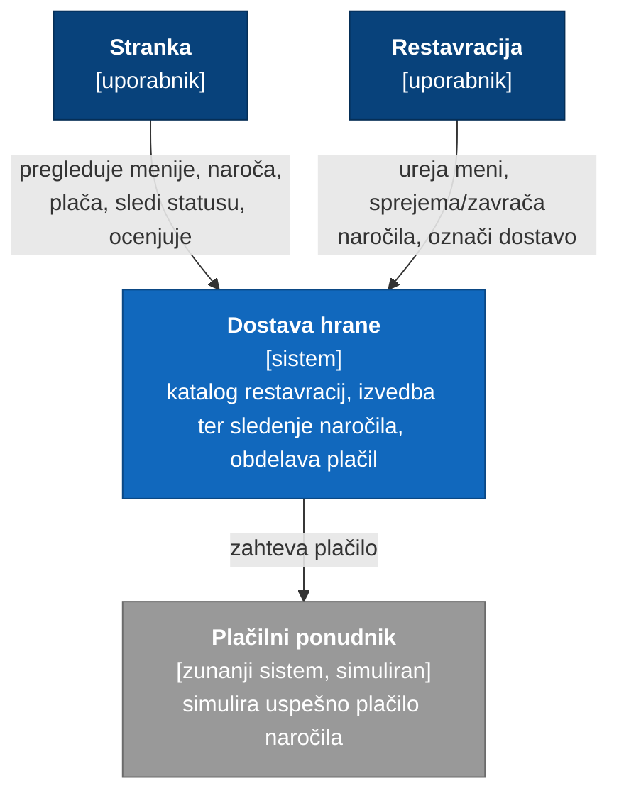

# C4 diagrami nivo 1: kontekst sistema

```mermaid
flowchart TB
    stranka["<b>Stranka</b><br/>[uporabnik]"]
    restavracija["<b>Restavracija</b><br/>[uporabnik]"]

    sistem["<b>Dostava hrane</b><br/>[sistem]<br/>katalog restavracij, izvedba ter sledenje naročila, obdelava plačil"]

    ponudnik["<b>Plačilni ponudnik</b><br/>[zunanji sistem, simuliran]<br/>simulira uspešno plačilo naročila"]

    stranka -- "pregleduje menije, naroča,<br/>plača, sledi statusu, ocenjuje" --> sistem
    restavracija -- "ureja meni, sprejema/zavrača<br/>naročila, označi dostavo" --> sistem
    sistem -- "zahteva plačilo" --> ponudnik

    classDef uporabnik fill:#08427b,stroke:#052e56,color:#fff
    classDef sistem fill:#1168bd,stroke:#0b4884,color:#fff
    classDef zunanji fill:#999999,stroke:#6b6b6b,color:#fff
    class stranka,restavracija uporabnik
    class sistem sistem
    class ponudnik zunanji
```

## Legenda

- **temno modro**: uporabniki sistema
- **modro**: naš sistem oziroma njegove storitve
- **sivo**: zunanji sistemi
- **polna črta**: sinhron klic